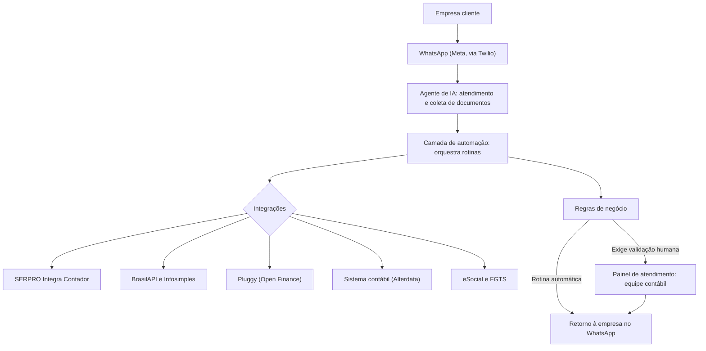

# Arquitetura conceitual: automação contábil via WhatsApp

> **Arquitetura conceitual.** Representação de produto, feita para alinhar escopo, integrações e pontos de falha com o cliente e com a engenharia. Não é a arquitetura técnica oficial do sistema: componentes internos, infraestrutura e tecnologias de implementação não estão representados.

## Diagrama

## Explicação

| Camada | O que acontece |
|---|---|
| **Entrada** | A empresa cliente conversa no WhatsApp: faz a solicitação e envia documentos. |
| **Processamento** | O agente de IA identifica a empresa e a solicitação e coleta o que falta. A camada de automação transforma a solicitação em rotina. |
| **Integrações** | A rotina consulta ou envia dados a serviços fiscais federais, fontes públicas, Open Finance, obrigações trabalhistas e ao sistema contábil do escritório. |
| **Regras** | Definem o perfil atendido (no MVP, MEI com tributação fixa e até um funcionário) e quando a rotina exige humano, como na finalização da abertura de CNPJ. |
| **Saída** | Retorno à empresa no WhatsApp, ou pedido no painel de atendimento para a equipe contábil finalizar. |

## Possíveis pontos de falha

Análise de produto sobre a arquitetura conceitual:

| Ponto | Falha possível | Pergunta que o PRD precisa responder |
|---|---|---|
| WhatsApp | Conversa fora da janela de 24 horas | Quais mensagens de modelo precisam de aprovação da Meta? |
| Agente de IA | Documento ilegível ou do tipo errado | Como o agente pede o reenvio, e quantas tentativas antes de chamar um humano? |
| Integrações | API externa indisponível ou lenta | A rotina espera, reprocessa ou vai para fila humana? |
| Regras | Empresa fora do perfil do MVP | Qual mensagem a empresa recebe e quem assume o atendimento? |
| Painel | Pedido parado aguardando validação humana | Existe prazo ou alerta para a equipe contábil? |
| Dados | Divergência entre fonte pública e informação da empresa | Qual fonte prevalece e quem decide? |
