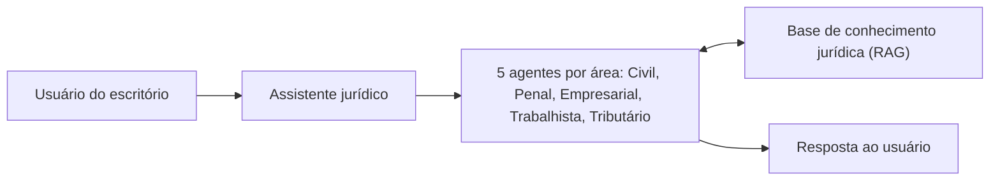

# Case 02: Assistente jurídico com RAG

**Setor:** jurídico | **Papel:** Product Owner | **Período:** jul. a set. de 2026 | **Status:** em sustentação

> **Resumo.** Um escritório de advocacia usava um assistente de IA com RAG, dividido em agentes por área do direito. Atuei como PO das correções, da revisão de arquitetura e da monetização. A revisão mostrou que a documentação indicava 14 agentes, mas apenas 5 estavam em produção. Corrigi a fonte da verdade, documentei a arquitetura da base, escrevi as histórias de trial e cobrança e recomendei o modelo de custo.

## 1. Contexto

Escritório de advocacia com um assistente de IA baseado em RAG: o assistente responde a partir de uma base de conhecimento jurídica, dividida em agentes especializados por área do direito. O produto já estava em operação.

## 2. Problema

1. Bugs e problemas de desempenho no produto em operação.
2. Divergência entre o escopo documentado e o escopo real.
3. Modelo de custo de infraestrutura a redefinir, e com ele o modelo de cobrança.

## 3. Meu papel

### Minha responsabilidade

| Atividade | Status |
|---|---|
| Product Owner das correções, da arquitetura e da monetização | Comprovado |
| Revisão e correção da documentação de arquitetura | Comprovado |
| Documentação da arquitetura da base, manual de migração e backlog de precificação (12 a 31/08) | Comprovado |
| Histórias de trial, cobrança e projetos no backlog | Comprovado |
| Estruturação das alternativas de modelo de custo e recomendação | Comprovado |

### Responsabilidade do time técnico

| Atividade | Status |
|---|---|
| Implementação das correções e melhorias de desempenho | **[A VALIDAR]**: a conclusão das correções está registrada; a execução técnica cabe ao time de desenvolvimento, sem detalhamento documentado |
| Infraestrutura, modelos de linguagem e base vetorial | **[EVIDÊNCIA INSUFICIENTE]** |

## 4. Problemas encontrados

| Problema | Evidência |
|---|---|
| Documentação com 14 agentes; 5 em produção | Comprovado |
| Correções de bugs e desempenho pendentes | Comprovado |
| Ausência de modelo de cobrança definido para o custo de infraestrutura | Comprovado |

## 5. Arquitetura documentada

| Fonte | Agentes |
|---|---|
| Documentação inicial | 14 |
| Em produção, após a revisão | 5: Civil, Penal, Empresarial, Trabalhista e Tributário |

Documentei a arquitetura da base de conhecimento. O conteúdo técnico desse documento (estrutura da base, modelos, infraestrutura) não é reproduzido neste portfólio: **[EVIDÊNCIA INSUFICIENTE neste portfólio]**.

## 6. RAG

O assistente responde com base em uma base de conhecimento jurídica (RAG). Componentes internos, como modelo de embeddings, banco vetorial e estratégia de recuperação: **[EVIDÊNCIA INSUFICIENTE]**.

## 7. Agentes

> **Arquitetura conceitual reconstruída a partir das evidências funcionais disponíveis.** Como a pergunta chega ao agente de cada área: **[EVIDÊNCIA INSUFICIENTE]**.

## 8. Correções

Correções de bugs e melhorias de desempenho concluídas. Métricas antes e depois (tempo de resposta, taxa de erro): **[EVIDÊNCIA INSUFICIENTE]**.

## 9. Produto

Com a base de agentes corrigida, o produto passou a ser tratado como serviço recorrente: precificação, trial e cobrança entraram no backlog.

## 10. Monetização

| Item | Conteúdo |
|---|---|
| Recomendação | A empresa fornecedora mantém a infraestrutura e repassa o custo, com margem, como mensalidade de serviço (SaaS) |
| Demais alternativas avaliadas | **[EVIDÊNCIA INSUFICIENTE neste portfólio]** |
| Backlog de precificação | Documentado |

## 11. Trial

História de período de teste de 7 dias no backlog.

**[ILUSTRATIVO]** Critérios no formato que uso:

| # | Critério |
|---|---|
| CA-01 | Um usuário novo tem acesso completo ao assistente por 7 dias corridos a partir do cadastro. |
| CA-02 | No 8º dia sem assinatura ativa, o usuário vê a tela de assinatura ao tentar fazer uma consulta. |

## 12. Cobrança

História de cobrança no backlog. Regras de cobrança: **[EVIDÊNCIA INSUFICIENTE neste portfólio]**.

**[A VALIDAR: desfecho comercial do aditivo não localizado nas evidências disponíveis.]** O modelo de monetização recomendado não equivale a um aditivo comercial aprovado.

## 13. Decisões

| Decisão | Por quê |
|---|---|
| Corrigir a documentação de arquitetura antes de qualquer nova funcionalidade | Documento desatualizado distorce a conversa comercial (aprendizado registrado) |
| Recomendar o repasse da infraestrutura como mensalidade | Racional: **[A VALIDAR]** |

## 14. Resultados

| Resultado | Status |
|---|---|
| Documentação corrigida para os 5 agentes em produção | Comprovado |
| Correções e melhorias de desempenho concluídas | Comprovado |
| Arquitetura da base, manual de migração e backlog de precificação entregues | Comprovado |
| Modelo de custo recomendado | Comprovado |
| Produto em sustentação | Comprovado |
| Aditivo comercial | **[A VALIDAR]** |

## 15. Aprendizados

Corrigir a fonte da verdade vem antes de qualquer nova funcionalidade. Em produtos de IA, "quantos agentes temos" define custo, preço e expectativa do cliente.

## 16. Limitações

- Não há métrica de desempenho antes e depois das correções.
- Os componentes técnicos do RAG não estão documentados neste portfólio.
- O desfecho comercial do modelo de cobrança não foi localizado.
