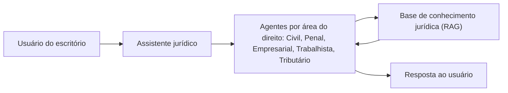

# Case 02: Assistente jurídico com RAG

**Setor:** jurídico | **Papel:** Product Owner | **Período:** jul. a set. de 2026 | **Status:** em sustentação

> **Resumo.** Um escritório de advocacia usava um assistente de IA com RAG, dividido em agentes por área do direito. Assumi o produto para correções, revisão de arquitetura e monetização. A revisão mostrou que a documentação indicava 14 agentes, mas apenas 5 estavam em produção. Corrigi a fonte da verdade antes de qualquer nova funcionalidade e estruturei o modelo de custo, com recomendação de repassar a infraestrutura como mensalidade de serviço.

## Contexto

Escritório de advocacia com um assistente de IA baseado em RAG: o assistente responde com base em uma base de conhecimento jurídica, dividida em agentes especializados por área do direito. O produto já estava em uso quando o assumi.

**Meu papel:** PO das correções, da revisão de arquitetura e da monetização.

## Problema

Três problemas ao mesmo tempo:

1. **Correções e desempenho:** havia bugs e problemas de desempenho a resolver.
2. **Escopo percebido x escopo real:** a documentação de arquitetura indicava muito mais agentes do que de fato estavam em produção.
3. **Modelo de custo:** o custo de infraestrutura precisava ser redefinido, e com ele o modelo de cobrança do cliente.

## Discovery

Revisão da documentação de arquitetura contra o que estava efetivamente em produção.

| Fonte | Agentes |
|---|---|
| Documentação de arquitetura | 14 |
| Em produção | 5: Civil, Penal, Empresarial, Trabalhista e Tributário |

Método de verificação de cada agente (acesso ao ambiente, testes, conversa com engenharia): **[NÃO DOCUMENTADO]**.

## Insights

- **Documento desatualizado é dívida de produto.** Quando o cliente acredita ter mais do que tem, qualquer conversa comercial começa torta: o cliente cobra o que não existe, e a precificação parte de uma base errada.
- O modelo de custo não podia ser discutido antes de a base de agentes estar correta, porque o custo depende do que de fato roda.

## Decisão

| Decisão | Por quê |
|---|---|
| Corrigir a documentação de arquitetura antes de qualquer nova funcionalidade | Toda decisão seguinte, técnica ou comercial, dependia da fonte da verdade |
| Estruturar alternativas de modelo de custo e recomendar uma | O cliente precisava decidir com opções claras, não com uma conta solta |
| Recomendação: o fornecedor mantém a infraestrutura e repassa o custo, com margem, como mensalidade de serviço (SaaS) | Previsibilidade de custo para o cliente e operação centralizada para o fornecedor |

Detalhamento das demais alternativas avaliadas: **[NÃO DOCUMENTADO neste portfólio]**.

## Requisitos

- Correções e melhorias organizadas em histórias com critérios de aceite verificáveis.
- Histórias de monetização: período de teste (trial) de 7 dias e cobrança.
- Backlog de precificação.

**[ILUSTRATIVO]** Critérios de aceite no formato que uso, para a história de trial:

| # | Critério |
|---|---|
| CA-01 | Um usuário novo tem acesso completo ao assistente por 7 dias corridos a partir do cadastro. |
| CA-02 | No 8º dia sem assinatura ativa, o usuário vê a tela de assinatura ao tentar fazer uma consulta. |

## Solução

Arquitetura conceitual, limitada ao que está documentado:

> **Arquitetura conceitual.** O mecanismo que direciona a pergunta ao agente da área, os modelos de linguagem usados e a estrutura interna da base não estão documentados neste portfólio: **[NÃO DOCUMENTADO]**.

Artefatos entregues: documentação da arquitetura da base, manual de migração e backlog de precificação.

## MVP

Não se aplica: o produto já estava em produção. A decisão de produto equivalente foi priorizar a correção da fonte da verdade e as correções sobre qualquer funcionalidade nova.

## Riscos

| Risco | Tratamento |
|---|---|
| Conversa comercial baseada em escopo inexistente | Documentação corrigida para os 5 agentes reais |
| Custo de infraestrutura sem dono definido | Modelo de custo com recomendação explícita |
| Resposta fora do que a base sustenta, risco inerente a RAG | Especificação de comportamento e testes por área. Critérios específicos do projeto: **[A VALIDAR]** |

## Validação

- Correções de bugs e melhorias de desempenho concluídas.
- Métricas de desempenho antes e depois (tempo de resposta, taxa de erro): **[NÃO DOCUMENTADO]**.

## Resultado

**Resultado documentado:** documentação de arquitetura corrigida para os 5 agentes em produção; correções e melhorias de desempenho concluídas; modelo de custo recomendado; produto em sustentação.

**Pendente:** o aditivo comercial dependia da confirmação do modelo de cobrança pelo cliente. Desfecho: **[A VALIDAR]**.

## Aprendizado

Corrigir a fonte da verdade vem antes de qualquer nova funcionalidade. Em produtos de IA, o "quantos agentes temos" não é detalhe técnico: define custo, preço e expectativa do cliente.
