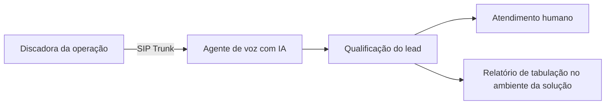

# Case 04: Agente de voz em call center

**Setor:** serviços financeiros | **Papel:** Product Owner | **Período:** jul. a set. de 2026 | **Status:** [CONFLITO ENTRE FONTES: VALIDAR] histórias de correção registradas como concluídas; status do projeto em set. de 2026: correções em testes

> **Resumo.** Agente de IA de voz que atende o lead pela discadora da operação, via SIP Trunk, qualifica e tabula antes do atendimento humano. Depois da entrega, surgiram problemas de expectativa, integração, teste e latência. Conduzi a reunião de crise, criei o épico de correções no mesmo dia e mudei a solução onde o sistema de terceiro não suportava o desenho original.

## Contexto

Call center com triagem feita por atendentes antes de direcionar cada cliente. A solução: um agente de voz (Twilio) conectado à discadora da operação via SIP Trunk, que qualifica e tabula a chamada antes do atendimento humano.

**Meu papel:** PO da entrega e das correções. Escrevi o épico e as histórias, montei o roteiro de testes, conduzi a demonstração, o alinhamento técnico com o fornecedor da discadora e a reunião de crise.

## Responsabilidades

### Minha responsabilidade

| Atividade | Status |
|---|---|
| Épico e histórias da triagem | Comprovado |
| Roteiro de testes e guia de alinhamento técnico | Comprovado |
| Demonstração ao cliente | Comprovado |
| Alinhamento com o fornecedor da discadora | Comprovado |
| Condução da reunião de crise e plano de ação | Comprovado |
| Épico de correções, criado no mesmo dia da crise | Comprovado |
| Auditoria pós-entrega contra a DoD | Comprovado |

### Responsabilidade de outras partes

| Parte | Papel documentado |
|---|---|
| Time de desenvolvimento (três devs) | Implementação do agente, integração por SIP Trunk e correções. Detalhamento técnico: **[A VALIDAR]** |
| Gestor da área | Presente na reunião de crise |
| Comercial | Venda e demonstração comercial do projeto |
| Fornecedor da discadora | Configuração do lado da discadora |

O produto utilizou Twilio, ElevenLabs (após a migração) e a discadora do cliente via SIP Trunk. Atuei na especificação, nos testes e na gestão do produto, não na implementação dessas integrações.

## Problema

Depois da entrega, quatro problemas apareceram juntos:

| Problema | Natureza |
|---|---|
| O cliente esperava um agente adaptativo, como na demonstração comercial; o entregue era um roteiro mais rígido | Expectativa |
| A discadora recebia apenas o áudio da chamada e não processava dados de volta, o que inviabilizava a tabulação integrada | Integração |
| O teste foi só de volume (40 mil chamadas simuladas), sem o ambiente de produção do cliente | Validação |
| Latência de cerca de 6 s para responder ao "alô", contra limite de 3 s da discadora, causando quedas | Limite técnico |

## Discovery

- **Auditoria pós-entrega** contra a Definition of Done, que revelou lacunas justamente nas histórias de tabulação e de escalonamento para atendente humano.
- **Escuta das gravações completas** do lote de teste, registrada como história própria de investigação, não como critério de aceite.
- **Alinhamento técnico** com o fornecedor da discadora para entender o que o sistema aceitava.

## Insights

- Os critérios de aceite originais permitiam interpretação. Por isso o QA funcional passou e a auditoria não.
- A tabulação integrada não era um bug: era uma premissa que o sistema de terceiro não suportava.
- Teste de carga não substitui teste no ambiente do cliente.

## Decisão

| Decisão | Por quê |
|---|---|
| Criar um épico de correções, no mesmo dia da reunião de crise, em vez de tratar bugs avulsos | Correções com histórias próprias e critérios reescritos para serem binários |
| Gerar o relatório de tabulação no ambiente próprio da solução | A discadora não processava dados de volta; insistir na integração não tinha saída |
| Migrar o motor de voz para outra plataforma (ElevenLabs) | Decisão tomada durante o ciclo de correções. Motivo detalhado: **[NÃO DOCUMENTADO]** |

## Requisitos

Histórias do épico de correções:

| Problema | História ou ação |
|---|---|
| Chamadas sem encerramento | Encerramento proativo da chamada pela IA |
| Frases repetitivas | Diversificação de frases em objeções |
| Diagnóstico sem base | História de investigação: ouvir as gravações completas do lote de teste |
| Operador virtual fora da URA | Ação: alinhamento técnico com o fornecedor da discadora |

**[ILUSTRATIVO]** Critérios binários no formato que passei a usar:

| Ruim | Bom |
|---|---|
| O agente deve encerrar a chamada adequadamente. | Após a despedida, o agente encerra a chamada em até 5 segundos sem fala do lead. |
| A tabulação deve funcionar. | Toda chamada encerrada recebe uma das tabulações da lista oficial no relatório. |

## Solução

> **Arquitetura conceitual.** Representa o desenho de produto após as correções, não a arquitetura técnica oficial.

## MVP

Não se aplica: o case trata da entrega e das correções de um escopo já contratado.

## Riscos

Os riscos que este case revelou (expectativa da venda, teste fora do ambiente real, limite técnico de terceiro e integração não suportada) estão no [registro de riscos do método](../../01-metodo/gestao-de-riscos.md).

## Validação

- Roteiro de testes e guia de alinhamento técnico produzidos.
- Operador virtual restaurado na URA após o alinhamento com o fornecedor da discadora.
- Histórias do épico de correções concluídas.

## Resultado

**Resultado documentado:** épico de correções com todas as histórias listadas concluídas; integração com a URA restaurada.

**Pendente:** na última verificação documentada, a tabulação em massa ainda não aparecia nos relatórios da discadora. Métricas de triagem (percentual de chamadas triadas sem intervenção humana): **[NÃO DOCUMENTADO]**.

## Aprendizado

- **Entregue não é aceito.** A auditoria pós-entrega encontrou o que o QA funcional não pegou. Desde então, todo critério que escrevo passa no teste: duas pessoas testando chegam à mesma conclusão?
- **O portão Comercial para Produto precisa capturar a promessa feita na venda.** Expectativa não escrita vira lacuna na entrega.
- **Limite de sistema de terceiro é requisito.** A latência máxima da discadora deveria estar no critério de aceite desde o início.
