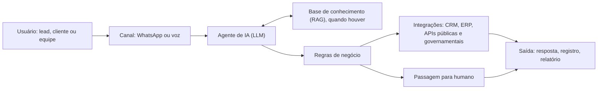

# Arquitetura conceitual

> **Arquitetura conceitual reconstruída a partir das evidências funcionais disponíveis.** O diagrama mostra o padrão comum aos produtos de IA que gerenciei, como representação de produto. Não é a arquitetura técnica oficial de nenhum deles.

## Padrão comum

## Como leio cada bloco como PO

| Bloco | O que preciso saber para especificar | Exemplo documentado |
|---|---|---|
| **Canal** | Limites e custo do canal | Custo por mensagem do WhatsApp ([case 03](../02-cases/03-gestao-de-escopo-imobiliario/)); latência máxima da discadora ([case 04](../02-cases/04-agente-de-voz-call-center/)) |
| **Agente** | Objetivo, script, o que não faz, quando encerra | Encerramento proativo e diversificação de frases ([case 04](../02-cases/04-agente-de-voz-call-center/)) |
| **Base de conhecimento** | O que está na base e o que existe de fato em produção | 5 agentes em produção contra 14 documentados ([case 02](../02-cases/02-assistente-juridico-rag/)) |
| **Regras de negócio** | Qual perfil é atendido e quando o fluxo para | MVP para MEI; finalização humana da abertura de CNPJ ([case 01](../02-cases/01-automacao-contabil-whatsapp/)) |
| **Integrações** | Se o sistema tem API, o que aceita e o que devolve | Discadora que não processava dados de volta ([case 04](../02-cases/04-agente-de-voz-call-center/)); sistema sem API ([case 06](../02-cases/06-discovery-planos-assistenciais/)) |
| **Passagem para humano** | Em que condições, com quais dados | Painel de atendimento para a equipe contábil ([case 01](../02-cases/01-automacao-contabil-whatsapp/)) |
| **Saída** | Onde o resultado fica registrado | Relatório de tabulação no ambiente próprio ([case 04](../02-cases/04-agente-de-voz-call-center/)) |

## Diagramas por case

- [Automação contábil via WhatsApp](../02-cases/01-automacao-contabil-whatsapp/arquitetura-conceitual.md), com pontos de falha
- [Assistente jurídico com RAG](../02-cases/02-assistente-juridico-rag/#7-agentes)
- [Agente de voz em call center](../02-cases/04-agente-de-voz-call-center/#solução)
